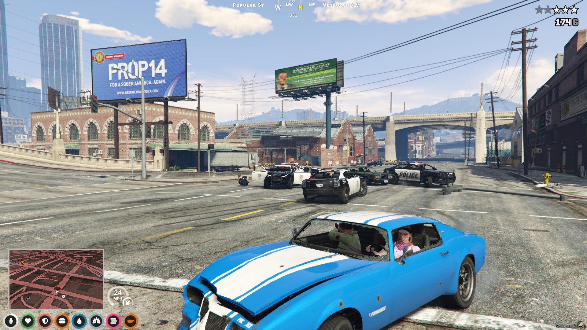
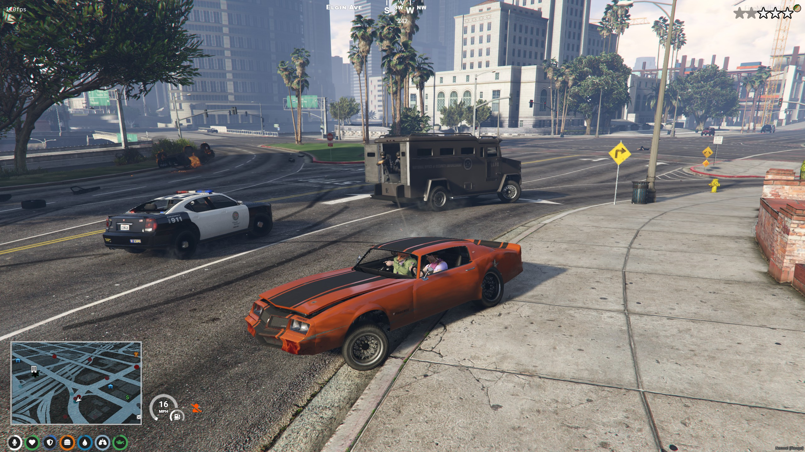
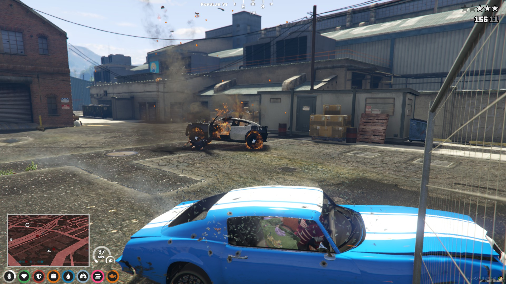
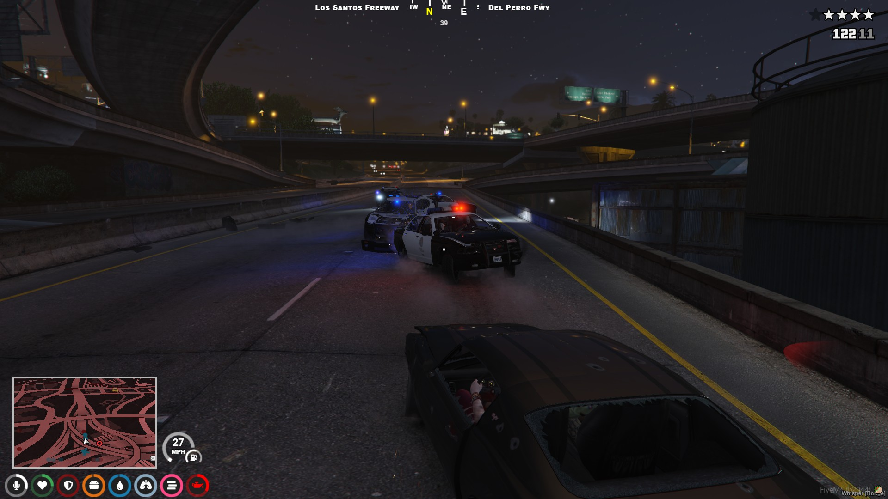

# Fenix Police Response 1.0.1

This mod enables AI police dispatch/wanted levels and replaces the base GTA V police dispatch system with something less punishing and more realistic. It is highly configurable and all configuration and code is thoroughly commented
to facilitate end-user modification. You could configure this to be even more brutal than base-game if you wanted, or even easier. The idea was to have AI police for a small RP server just for your friends where having a bunch of player police was not possible. 



**FEATURES:**
- Config option to only enable AI police if player police are not online. You can configure the number of player police required. And set whether they have to be onDuty to count toward the total. 
- Custom police loadouts per unit spawned, loadouts are randomized and include a spawnChance weighting to make them more or less likely. 
- Custom police units per "zone", by default separated into "jurisdictions" (aka regions) Los Santos, Paleto Bay, Sandy Shores, or Countryside. Includes a spawnChance weighting to make each unit more or less likely. 
  Also a minimum wanted level for them to spawn. By default I have the riot and fbi vehicles weighted much higher so once you hit those wanted levels they spawn far more often, but regular units can still respond too. 
- Each police unit has customizable peds assigned to them, so you can change the ped models if you wish. 
- Police helicopters will spawn at higher wanted levels. This is also configurable. By default they respond at 4 wanted stars instead of 3. 
- Military helicopters and planes can spawn if the player is in a helicopter or a plane themselves.
- Number of units spawned per wanted level is customizable. Separate settings for ground units, helicopters, and planes (aka air units).
- Dead police units are removed after a certain time, allowing more to spawn. This timer is customizable. Timers for ground units, helicopters, and air units are separate.
- Far away police units are removed after a certain time, allowing more to spawn. This timer is customizable. Timers for ground units, helicopters, and air units are separate.
- Customizable evasion times for each wanted level. 
- Customizable spawn distances for ground units, helicopters, and air units.
- Separate police units for each player. This means if two players are wanted together in the same car double the amount of police will spawn. If four wanted players are in a vehicle together you get four times the police response.
  I may consider changing this some day but I like the difficulty scaling with this. 
- Police are spawned serverside, then their networkIDs are sent back to the client that requested police so they can be controlled and maintained. They should not migrate to other clients, and the distance culling is high so they can still be controlled from far away. This means units will be properly sycned across clients and you will see police chasing other players. 
- Stolen police vehicles will not de-spawn if occupied by a player at the time the script tries to clean them up (due to peds being dead, peds being far away, or losing wanted stars). So they wont disappear if you manage to steal one mid chase. However, they will never despawn if this happens. I plan to add logic that removes them once the player abandons them for a certain time/distance in the future. 
- Players with police jobs can be protected from becoming wanted, option to apply this protection only when on-duty. 

**REQUIREMENTS:**

This mod requires QBCore for: Notifications, counting players with Police jobs online, checking near vehicles (because the native function for this was giving me trouble), and checking if isDying or inLastStand and cancelling wanted levels. 
In theory, it could be removed if you switch the near vehicle check to the native and remove notifications and last stand logic.


**KNOWN ISSUES:**
- Police vehicles stolen by players will never despawn if they are occupied by a player at the time the script would usually delete the vehicle (when losing wanted level, or if the peds for that vehicle are too far away or dead).


# EXPORT

Use these export calls
```lua
exports['fenix-police']:ApplyWantedLevel(wantedLevelHere) -- wanted level can be 1 to 5, this ADDS the wantedLevelHere value to the existing wanted level!
exports['fenix-police']:SetWantedLevel(wantedLevelHere) -- wanted level can be 1 to 5, this SETS the players wanted level to the wantedLevelHere value if it is higher than the current wanted level. 
```

# CREDITS

This script was created by me, Fenix, so I could play FiveM QB-Core multiplayer with my wife Rainbowicus. 

# SUPPORT

If you find this project helpful, consider supporting me via PayPal

[](https://www.paypal.com/donate/?hosted_button_id=8UEUW7KYFSF48)

I created this because streaming dispatch.meta and dispatchtuning.ymt is not supported by FiveM so there was no way to 
allow for AI police and also control how they spawn and behave.

I will keep adding to this mod as I have time and inspiration, I've got some big ideas. 

# INSTALL INSTRUCTIONS

**1)** Edit qb-smallresources\client\ignore.lua
qb-smallresources has a client\ignore.lua that needs changes made to it to prevent it from disabling police services and allows this mod to handle them directly instead:

a) For the following function comment out the block from SetAudioFlag down to the last RemoveVehiclesFromGeneratorsInArea

```lua
CreateThread(function() -- all these should only need to be called once
    if Config.Disable.ambience then
        StartAudioScene('CHARACTER_CHANGE_IN_SKY_SCENE')
        SetAudioFlag('DisableFlightMusic', true)
    end
    -- SetAudioFlag('PoliceScannerDisabled', true)
    -- SetGarbageTrucks(false)
    -- SetCreateRandomCops(false)
    -- SetCreateRandomCopsNotOnScenarios(false)
    -- SetCreateRandomCopsOnScenarios(false)
    -- DistantCopCarSirens(false)
    -- RemoveVehiclesFromGeneratorsInArea(335.2616 - 300.0, -1432.455 - 300.0, 46.51 - 300.0, 335.2616 + 300.0, -1432.455 + 300.0, 46.51 + 300.0) -- central los santos medical center
    -- RemoveVehiclesFromGeneratorsInArea(441.8465 - 500.0, -987.99 - 500.0, 30.68 - 500.0, 441.8465 + 500.0, -987.99 + 500.0, 30.68 + 500.0)     -- police station mission row
    -- RemoveVehiclesFromGeneratorsInArea(316.79 - 300.0, -592.36 - 300.0, 43.28 - 300.0, 316.79 + 300.0, -592.36 + 300.0, 43.28 + 300.0)         -- pillbox
    -- RemoveVehiclesFromGeneratorsInArea(-2150.44 - 500.0, 3075.99 - 500.0, 32.8 - 500.0, -2150.44 + 500.0, -3075.99 + 500.0, 32.8 + 500.0)      -- military
    -- RemoveVehiclesFromGeneratorsInArea(-1108.35 - 300.0, 4920.64 - 300.0, 217.2 - 300.0, -1108.35 + 300.0, 4920.64 + 300.0, 217.2 + 300.0)     -- nudist
    -- RemoveVehiclesFromGeneratorsInArea(-458.24 - 300.0, 6019.81 - 300.0, 31.34 - 300.0, -458.24 + 300.0, 6019.81 + 300.0, 31.34 + 300.0)       -- police station paleto
    -- RemoveVehiclesFromGeneratorsInArea(1854.82 - 300.0, 3679.4 - 300.0, 33.82 - 300.0, 1854.82 + 300.0, 3679.4 + 300.0, 33.82 + 300.0)         -- police station sandy
    -- RemoveVehiclesFromGeneratorsInArea(-724.46 - 300.0, -1444.03 - 300.0, 5.0 - 300.0, -724.46 + 300.0, -1444.03 + 300.0, 5.0 + 300.0)         -- REMOVE CHOPPERS WOW
end)
```


b) comment out this entire function, it will be handled by this mod instead

```lua
-- CreateThread(function()
    -- for i = 1, 15 do
        -- local toggle = Config.AIResponse.dispatchServices[i]
        -- EnableDispatchService(i, toggle)
    -- end

    -- local wantedLevel = Config.AIResponse.wantedLevels and 5 or 0
    -- SetMaxWantedLevel(wantedLevel)
-- end)
```


**2)** Edit qb-smallresources\config.lua

a) By default it disables the hud component for wanted stars in this block

hudComponents = {} will contain a 1 by default, this disables the wanted stars. You can check the referenced doc to see what each integer value corresponds to.
Mine is below, note that it does not contain a 1. 

```lua
Config.Disable = {
    hudComponents = { 2, 7, 9, 19, 20, 21, 22 }, -- Hud Components: https://docs.fivem.net/natives/?_0x6806C51AD12B83B8
    controls = { 37 },                                            -- Controls: https://docs.fivem.net/docs/game-references/controls/
    displayAmmo = true,                                           -- false disables ammo display
    ambience = true,                                             -- disables distance sirens, distance car alarms, flight music, etc
    idleCamera = true,                                            -- disables the idle cinematic camera
    vestDrawable = true,                                         -- disables the vest equipped when using heavy armor
    pistolWhipping = true,                                        -- disables pistol whipping
    driveby = false,                                              -- disables driveby
}
```

b) Find the BlacklistedPeds and set them to false so they can spawn

```lua
Config.BlacklistedPeds = {
    [`s_m_y_ranger_01`] = false,
    [`s_m_y_sheriff_01`] = false,
    [`s_m_y_cop_01`] = false,
    [`s_f_y_sheriff_01`] = false,
    [`s_f_y_cop_01`] = false,
    [`s_m_y_hwaycop_01`] = false,
}
```


**3)** Review config.lua and read all the comments about all the settings, change what you want.


**4)** Make sure you add "ensure fenix-police" to your server.cfg. 


# More Images






